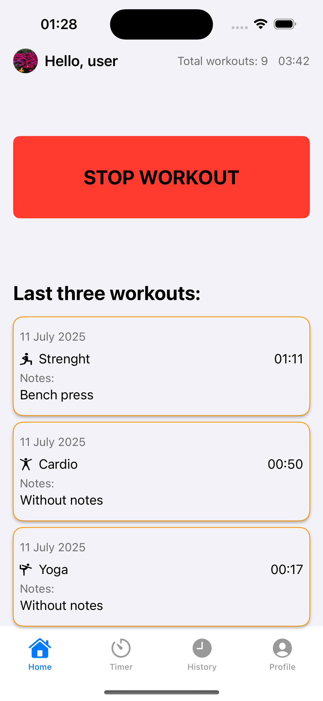
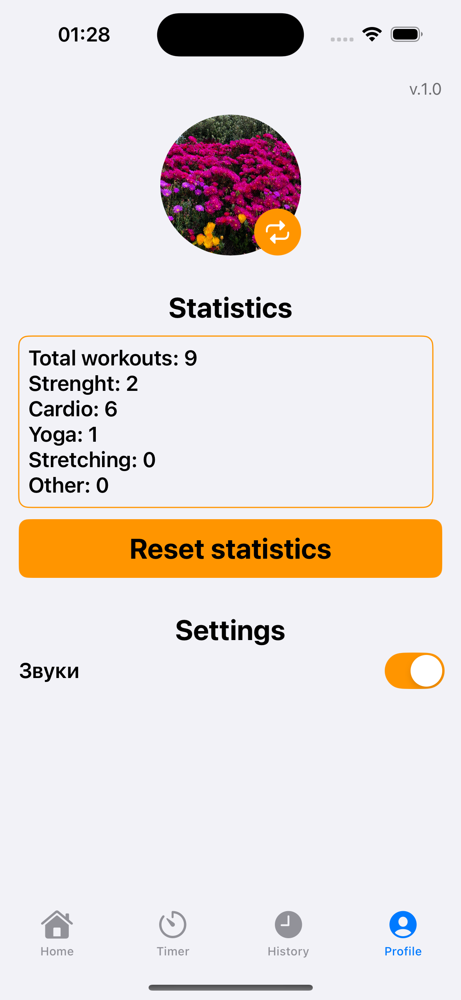

***Приложение SportTimer как тестовое задание***

**Архитектурные решения**
Приложение построено по архитектуре MVVM:
- **Model** — данные и логика. Используется `Workout` как основная модель, хранящаяся в CoreData. Тип тренировки — через `WorkoutType` (enum).
- **View** — интерфейс на SwiftUI. Простые вьюшки, получающие данные из ViewModel.
- **ViewModel** — логика отображения. Здесь обрабатываются данные, таймер, статистика и т.д.

 **Известные ограничения**
- В `TimerView` по умолчанию установлен таймер на **2 часа**, чтобы корректно работал прогресс-бар.
- Выбор продолжительности тренировки пока **не реализован** — эта функция **не предусмотрена текущим ТЗ**.
- UI тема всегда светлая

**Инструкция по запуску**

```bash
git clone https://github.com/IvankovDaniil/SportTimer.git
cd SportTimer
open SportTimer.xcodeproj
```

Минимальная версия iOS 16.0


**Скриншоты**

<div align="center">
<h3>Home View</h3>
  
  
</div>

<div align="center">
  <h3>Timer View</h3>
  
</div>

<div align="center">
  <h3>History View</h3>
  
</div>

<div align="center">
  <h3>History View — Search</h3>
  
</div>

<div align="center">
  <h3>Profile View</h3>
  
</div>